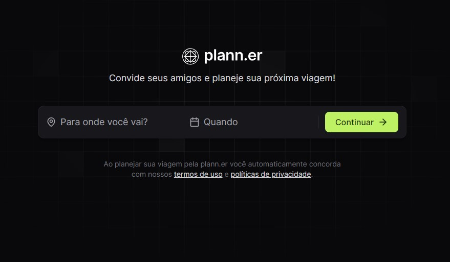

  

## 🚀 NLW Journey 2024

Esse projeto foi desenvolvido durante o evento NLW Journey 2024 da RocketSeat.
O objetivo do evento é desenvolver uma aplicação completa, desde o back-end em Node.js, front-end para web em ReactJS,
front-end mobile em React Native.

## Planejador de Viagens - Plann.er

O projeto é um site desktop para montar planos de viagem com amigos, registrar atividades e links úteis.

## Layout

Você pode visualizar o layout do projeto através [desse link](https://www.figma.com/design/UGfrAIc1rsMQ9LmrGszRkS/NLW-Journey-%E2%80%A2-Planejador-de-viagem-(Community)). É necessário ter conta no [Figma](http://figma.com/) para acessá-lo.

## Tecnologias Front-End

Esse projeto foi desenvolvido com as seguintes tecnologias no frontend:

- [React](https://reactjs.org)
- [TypeScript](https://www.typescriptlang.org/)
- [Vite](https://vitejs.dev)
- [Axios](https://axios-http.com)
- [Tailwind CSS](https://tailwindcss.com/)
- [Phosphor Icons](https://github.com/phosphor-icons/phosphor-react)

## Como executar

- Clone o repositório do backend, você pode encontrar aqui: [https://github.com/rocketseat-education/nlw-journey-nodejs]
- Renomeie o arquivo `.env.example` para `.env`
- Instale as dependências do backend (server) com `npm install`
- Crie as tabelas do banco de dados com `npx prisma migrate deploy`
- Inicie o servidor com `npm run dev` (deve rodar em [`localhost:3333`](http://localhost:3333))
- Para rodar esse frontend, entre na pasta `cd frontend`
- Instale as dependências com `npm install`
- Inicie o app com `npm run dev`

Link para consultar as rotas do backend: [https://nlw-journey.apidocumentation.com/reference]

## To do
- Fazer meu backend com Node.js
- Cadastrar um novo link importante
- Listar links importantes
- Deixar app responsivo
- Adicionar funcionalidade para o botão Alterar local/data
- Gerenciar convidados (poder adicionar novos)
